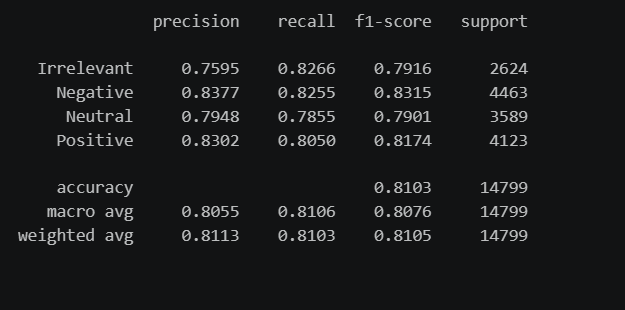
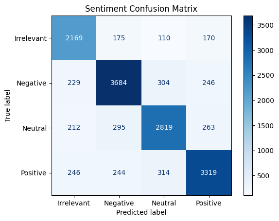

# Twitter Sentiment Analysis using Logistic Regression & TF-IDF.
An end-to-end Machine Learning NLP pipeline designed to classify Twitter posts into multi-class sentiment categories (**Irrelevant**, **Negative**, **Neutral**, **Positive**). 
This project evaluates textual feature extraction methods, hyperparameter optimization via 'GridSearchCV', and comparative performance against alternative algorithms (Multinomial Naive Bayes).
## Project Overview
- **Dataset:** twitter_training.csv (Multi-class Twitter sentiment dataset)
- **Primary Model:** Logistic Regression (class_weight='balanced')
- **Vectorization:** TF-IDF Vectorizer (Unigrams + Bigrams, custom stop-word handling)
- **Test Accuracy:** **~81.18%**
- **Hyperparameter Optimization:** GridSearchCV (3-Fold Cross-Validation)
## Tech Stack & Libraries
- **Language:** Python
- **Data Manipulation:** pandas
- **Machine Learning:** scikit-learn
- **Data Visualization:** matplotlib, seaborn
##  Key Results & Evaluation
Logistic Regression significantly outperformed Multinomial Naive Bayes (~73.65% test accuracy) due to its superior handling of feature weight distributions across overlapping n-grams.
## Classification Report Summary

## Confusion Matrix Visualization

